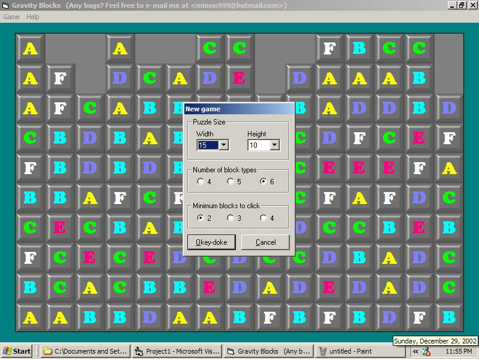



## Gravity Blocks Game

### Description

This is a game similar to MahJong Gravity Tile.

You click on a group of same blocks to remove them. How many blocks can you remove? Just check it out!!
 
### More Info
 

             |
---                |---
**Submitted On**   |2002-12-30 01:12:46
**By**             |[Min Thant Sin](https://github.com/Planet-Source-Code/PSCIndex/blob/master/ByAuthor/min-thant-sin.md)
**Level**          |Intermediate
**User Rating**    |5.0 (50 globes from 10 users)
**Compatibility**  |VB 6\.0
**Category**       |[Games](https://github.com/Planet-Source-Code/PSCIndex/blob/master/ByCategory/games__1-38.md)
**World**          |[Visual Basic](https://github.com/Planet-Source-Code/PSCIndex/blob/master/ByWorld/visual-basic.md)
**Archive File**   |[Gravity\_Bl15206412302002\.zip](https://github.com/Planet-Source-Code/min-thant-sin-gravity-blocks-game__1-42003/archive/master.zip)

### API Declarations

BitBlt and sndPlaySound

